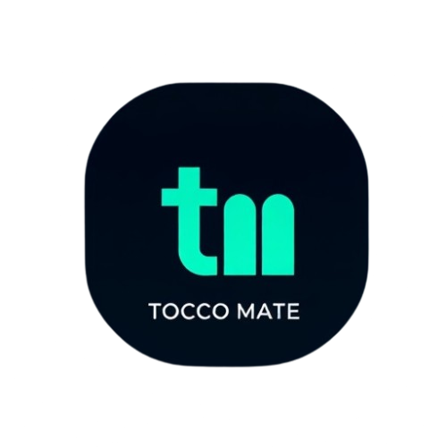

<div align="center">



# tocco-mate

**Inoffizieller Scraper für das WISS Tocco-Schulportal.**
Holt deine Noten und deinen Stundenplan automatisch — Web-Dashboard, Mobile-App (PWA), Telegram-Bot und Push-Benachrichtigungen aus einem Guss.

[](https://github.com/JoKerIsCraZy/tocco-mate/pkgs/container/tocco-mate)
[](LICENSE)
[](package.json)
[](https://playwright.dev)

</div>

---

## Was kann es?

- 📊 **Noten-Dashboard** mit Durchschnitten, Filter, Modul-Detail (LB / ZP / Gewichtung)
- 📱 **Mobile-App / PWA** unter `/mobile/` — installierbar auf iOS & Android
- 🔔 **Push-Benachrichtigungen** auf dein Handy bei neuen Noten und Zimmerwechseln (auch mit geschlossener App)
- 📅 **Stundenplan** mit kommenden Terminen
- ⏱ **Auto-Scrape** im Intervall- oder Wochenplan-Modus
- 💬 **Telegram-Bot** mit Live-Tracking, Push und interaktivem Menü
- 🔒 **Anti-Brute-Force** + Bearer-Token-Auth — sicher hinter Reverse-Proxy
- 📜 **SQLite-Historie** aller Notenänderungen

---

## Quick Start (Docker)

> Ersetze `MS_EMAIL` und `MS_PASSWORD` durch deine Microsoft-SSO-Zugangsdaten.

```bash
docker run -d --name tocco-mate --restart unless-stopped -p 3000:3000 \
  -e MS_EMAIL="dein.name@wiss-edu.ch" \
  -e MS_PASSWORD="DEIN_PASSWORT" \
  -v "$(pwd)/data:/app/data" \
  ghcr.io/jokeriscrazy/tocco-mate:latest
```

Danach:

```bash
docker logs tocco-mate | grep AUTO-GENERATED       # API-Token holen
```

→ Dashboard öffnen: **http://localhost:3000** + Token einloggen.

<details>
<summary><strong>Windows / Compose / NAS-Varianten</strong></summary>

### Windows PowerShell
```powershell
docker run -d --name tocco-mate --restart unless-stopped -p 3000:3000 `
  -e MS_EMAIL="dein.name@wiss-edu.ch" `
  -e MS_PASSWORD="DEIN_PASSWORT" `
  -v "${PWD}/data:/app/data" `
  ghcr.io/jokeriscrazy/tocco-mate:latest
```

### Docker Compose
```bash
git clone https://github.com/JoKerIsCraZy/tocco-mate.git && cd tocco-mate
cp .env.example .env       # Werte eintragen
docker compose up -d
```

### NAS / Unraid (Permission-Fix)
Bei `EACCES`-Fehlern auf `/app/data/*` zusätzlich `-e PUID=$(id -u) -e PGID=$(id -g)` setzen. Default `1000`/`1000`.

| Plattform | Werte |
|---|---|
| Linux / macOS / WSL | `PUID=$(id -u)`, `PGID=$(id -g)` |
| Unraid | `PUID=99`, `PGID=100` |
| Synology | `PUID=1026`, `PGID=100` |
| QNAP | `PUID=1000`, `PGID=100` |

</details>

<details>
<summary><strong>Lokal ohne Docker (Entwicklung)</strong></summary>

```bash
git clone https://github.com/JoKerIsCraZy/tocco-mate.git && cd tocco-mate
npm install
npm run setup        # Playwright Chromium
cp .env.example .env # Werte eintragen
npm run serve        # Server auf Port 3000
```

Voraussetzungen: **Node.js >= 20**, ~300 MB für Chromium, WISS-Schulaccount.

</details>

---

## Mobile-App (PWA)

Die Mobile-View läuft unter **`/mobile/`** und ist als PWA installierbar.

### Installation auf dem Handy

1. Im Dashboard auf **„Smartphone-View"** tippen → öffnet `/mobile/`
2. Token einmalig eingeben (kommt aus dem Dashboard-Login)
3. Browser-Menü öffnen:
   - **Android (Chrome / Brave / Edge):** ⋮ → **„App installieren"** / **„Zum Startbildschirm hinzufügen"**
   - **iOS (Safari):** Teilen-Symbol → **„Zum Home-Bildschirm"**

Danach hast du ein normales App-Icon auf deinem Handy.

### Push-Benachrichtigungen

In der installierten Mobile-App: **Settings → „Push aktivieren"** → Erlauben → Test-Button drücken.

Push-Auslöser:

| Ereignis | Inhalt |
|---|---|
| 🆕 Neue Note | Modulname + Note + Direktlink zum Modul-Detail |
| ✏️ Notenänderung | Vorher → Nachher + Modulname |
| 🚪 Zimmerwechsel | Datum, Zeit, alter → neuer Raum (auch Online ↔ Offline) |

Notifications kommen **auch wenn die App komplett geschlossen ist** — per Mozilla Autopush / Google FCM / Apple Web Push.

> **iOS-Hinweis:** Push funktioniert dort nur in der **installierten** PWA, nicht im Safari-Tab (iOS-Sicherheitsregel).
> **Brave-Hinweis:** auf Brave Desktop muss `brave://settings/privacy` → „Google-Dienste für Push-Nachrichten verwenden" aktiviert sein.

---

## Konfiguration

Alle Settings über `.env` oder Docker `-e`. **Pflichtwerte** sind fett markiert.

### Pflicht

| Variable | Beschreibung |
|---|---|
| **`MS_EMAIL`** | Microsoft-SSO E-Mail (`name@wiss-edu.ch`) |
| **`MS_PASSWORD`** | Microsoft-Passwort |

### Häufig genutzt

| Variable | Default | Beschreibung |
|---|---|---|
| `API_TOKEN` | *auto* | Schutz für `/api/*`-Routen. Leer lassen = Auto-Generierung |
| `TELEGRAM_ENABLED` | `false` | Telegram-Bot einschalten |
| `TELEGRAM_TOKEN` | — | Bot-Token von [@BotFather](https://t.me/BotFather) |
| `TELEGRAM_ALLOWED_USER_ID` | — | Deine User-ID von [@userinfobot](https://t.me/userinfobot) |
| `ALLOW_UI_CREDENTIALS` | `false` | Wenn `true`, können Credentials im UI geändert werden (landen dann in `data/settings.json`) |
| `TZ` | `Europe/Zurich` | Zeitzone für Logs/Telegram |
| `PORT` | `3000` | HTTP-Port |

<details>
<summary><strong>Erweitert (URLs, Browser, VAPID, PUID)</strong></summary>

| Variable | Default | Beschreibung |
|---|---|---|
| `TOCCO_BASE` | `https://wiss.tocco.ch` | Tocco-Basis-URL |
| `NOTEN_URL` | *Notenseite* | Tocco-Noten-URL |
| `STUNDENPLAN_URL` | *Stundenplanseite* | Tocco-Stundenplan-URL |
| `USER_PK` | — | Tocco-User-Primärschlüssel |
| `HEADLESS` | `true` | `false` = sichtbarer Browser (Debug) |
| `SLOW_MO` | `0` | Millisekunden zwischen Playwright-Aktionen |
| `DEBUG_SCRAPER` | `false` | DOM-Dumps bei Fehlern |
| `VAPID_PUBLIC_KEY` | *auto* | Web-Push-Public-Key. Auto-generiert in `data/vapid.json` falls leer |
| `VAPID_PRIVATE_KEY` | *auto* | Web-Push-Private-Key |
| `VAPID_SUBJECT` | `mailto:admin@example.com` | Kontakt-Adresse für Push-Provider |
| `PUID` | `1000` | Container-User-ID (NAS-Permissions) |
| `PGID` | `1000` | Container-Group-ID |

URL-Variablen sind **env-only** — können nicht über das Web-UI geändert werden (SSRF-Schutz).

</details>

---

## API

Alle Endpoints (außer `/healthz`) erfordern Bearer-Token.

```bash
curl -H "Authorization: Bearer $API_TOKEN" http://localhost:3000/api/noten
```

| Methode | Pfad | Beschreibung |
|---|---|---|
| `GET` | `/healthz` | Health-Check (kein Auth) |
| `GET` | `/api/status` | Scheduler- und Server-Status |
| `GET / PATCH` | `/api/settings` | Settings lesen / ändern |
| `GET` | `/api/noten` | Noten (`?semester=S1&sortBy=note`) |
| `GET` | `/api/noten/:id/pruefungen` | LB/ZP/Sonstige eines Moduls |
| `GET` | `/api/stundenplan` | Termine (`?from=YYYY-MM-DD&limit=100`) |
| `POST` | `/api/stundenplan/clear` | Alle Stundenplan-Einträge löschen |
| `GET` | `/api/history/:id` | Notenverlauf eines Moduls |
| `GET` | `/api/stats` | Gesamt-Statistiken |
| `POST` | `/api/scrape` | Manuellen Scrape auslösen |
| `GET` | `/api/logs` | Letzte Log-Zeilen |
| `GET` | `/api/events` | SSE-Stream für Live-Status |
| `GET` | `/api/push/vapid-key` | VAPID-Public-Key der PWA |
| `POST / DELETE` | `/api/push/subscribe` | Push-Subscription registrieren / entfernen |
| `POST` | `/api/push/test` | Test-Push an alle Subscriptions |

---

## Telegram-Bot

1. Bot bei [@BotFather](https://t.me/BotFather) erstellen → Token
2. User-ID von [@userinfobot](https://t.me/userinfobot)
3. In `.env` setzen + Server neu starten

### Befehle

| Befehl | Funktion |
|---|---|
| `/menu` | Hauptmenü |
| `/noten` | Notenübersicht (Modul-Klick → LB/ZP-Liste) |
| `/durchschnitt` | Schnitt gesamt + pro Semester |
| `/heute` `/morgen` `/woche` | Stundenplan-Auszüge |
| `/stundenplan` | Bis 1 Monat (Multi-Message für „Alle") |
| `/scrape` | Manueller Scrape mit Live-Phase-Anzeige |
| `/status` | Server-Status |

---

## Sicherheit

- 🔐 **Bearer-Token** auf allen `/api/*`-Routen — Token via Header oder (für SSE) Query
- 🛡 **Anti-Brute-Force**: 10 Fehlversuche / 15 min → 15 min Lockout · 50 / 6 h → 6 h Lockout
- 🚫 **SSRF-Schutz**: Tocco-URLs nur via ENV setzbar · Push-Endpoints auf Whitelist (FCM, Mozilla, Apple, Windows) beschränkt
- 🔑 **Credentials**: standardmäßig env-only (`ALLOW_UI_CREDENTIALS=false`). Bei `true` landen sie in `data/settings.json` (Mode 0600)
- 🌐 **Netzwerk**: für öffentliche Exposition **immer** Reverse-Proxy mit TLS (Caddy / Traefik / nginx)
- 📁 **`data/`** enthält Sessions, Tokens, optional Credentials und VAPID-Keys — niemals veröffentlichen

---

## Architektur

```
tocco-mate/
├── src/
│   ├── server.js     Express-API, Scheduler, SSE
│   ├── scraper.js    Playwright Login + Scraping
│   ├── db.js         SQLite (Noten, Historie, Push)
│   ├── push.js       Web-Push (VAPID, FCM/Mozilla/Apple)
│   ├── bot.js        Telegram-Bot
│   └── settings.js   Config-Management
├── web/
│   ├── index.html    Dashboard
│   ├── mobile/       PWA (HTML/CSS/JS + Service-Worker)
│   └── assets/       Logo, Favicons, PWA-Icons
├── data/             Runtime (Docker-Volume)
├── Dockerfile
└── docker-compose.yml
```

**Stack:** Node.js 20 · Express 5 · Playwright 1.59 · SQLite (nativ via `node:sqlite`) · web-push · Vanilla-JS-Frontend (kein Build-Step)

### SQLite-Tabellen

| Tabelle | Inhalt |
|---|---|
| `noten` | Modul-Stammdaten + aktuelle Note |
| `noten_history` | Verlauf aller Notenänderungen |
| `noten_pruefungen` | LB / ZP / OTHER pro Modul mit Gewicht |
| `stundenplan` | Termine mit Datum, Zeit, Raum, Dozent |
| `push_subscriptions` | PWA-Push-Subscriptions (endpoint + Krypto-Keys) |

---

## Troubleshooting

| Symptom | Lösung |
|---|---|
| Login schlägt fehl | Passwort/MFA prüfen. `HEADLESS=false` für visuelles Debugging. |
| `Executable doesn't exist` (Playwright) | `npx playwright install chromium` |
| Token vergessen | `data/.api-token` löschen + Restart → neuer Token in Logs |
| Mobile-Push aktivieren geht nicht | Mobile braucht **HTTPS**. Über LAN-IP funktioniert's nicht (Browser-Sicherheitsregel) |
| iOS Push-Toggle ausgegraut | Erst PWA über Safari → „Zum Home-Bildschirm" installieren |
| Brave-Push schlägt fehl | `brave://settings/privacy` → „Google-Dienste für Push-Nachrichten verwenden" aktivieren |
| Stundenplan zeigt alte Einträge | Im Stundenplan-Tab „DB zurücksetzen" → manueller Scrape |
| Wochen-Check soll erneut laufen | `data/.weekly-detail-at` löschen + Restart |
| Keine LB/ZP im Modul | Beim nächsten Scrape wird's nachgezogen, manuell via `/scrape` |

---

## Mitwirken & Lizenz

Beiträge willkommen — siehe [CONTRIBUTING.md](CONTRIBUTING.md).
Veröffentlicht unter [MIT-Lizenz](LICENSE).

> **Disclaimer:** Inoffizielles Hobby-Projekt. Keine Verbindung zur WISS oder Tocco AG. Bitte respektiere die ToS deiner Schule.

---

<div align="center">

**English?** `tocco-mate` is an unofficial scraper for the WISS Tocco portal: grades, schedule, web dashboard, installable PWA with Web-Push, and Telegram-Bot.

```bash
docker run -d --name tocco-mate -p 3000:3000 \
  -e MS_EMAIL="..." -e MS_PASSWORD="..." \
  ghcr.io/jokeriscrazy/tocco-mate:latest
```

The auto-generated `API_TOKEN` is printed on first start. **Always use a reverse proxy with TLS** for public exposure.

</div>
